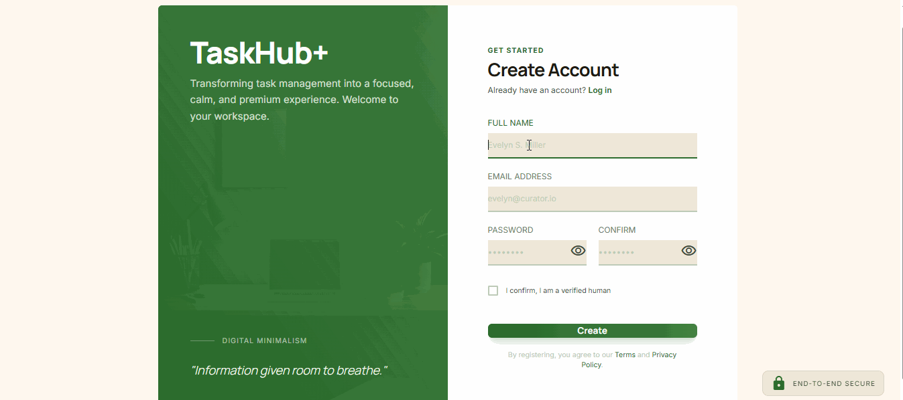

# TaskHub+

TaskHub+ adalah platform manajemen tugas modern yang dibangun dengan arsitektur terpisah antara backend dan frontend untuk memastikan skalabilitas dan performa yang optimal.

## Teknologi Utama

- **Backend:** Laravel 10 (PHP 8.2+)
- **Frontend:** Next.js 14 (TypeScript)
- **Database:** MySQL / MariaDB
- **Styling:** Tailwind CSS

---

## Struktur Proyek

Proyek ini terbagi menjadi dua bagian utama:
1. **[Backend](backend/README.md)**: Berisi REST API, autentikasi, dan logika bisnis.
2. **[Frontend](frontend/README.md)**: Berisi antarmuka pengguna (UI), integrasi API, dan desain responsif.

---

## Cara Instalasi dan Pengujian

### 1. Persiapan Dasar
Pastikan lingkungan pengembangan Anda memiliki:
- PHP >= 8.2
- Node.js >= 18 (LTS)
- Composer
- Database MySQL

### 2. Konfigurasi Backend
```bash
cd backend
composer install
cp .env.example .env
php artisan key:generate
php artisan migrate --seed
php artisan serve
```
*Instruksi lengkap dan dokumentasi pengujian API dapat ditemukan di [backend/README.md](backend/README.md).*

### 3. Konfigurasi Frontend
```bash
cd frontend
pnpm install
pnpm dev
```
*Instruksi lengkap dan dokumentasi desain dapat ditemukan di [frontend/README.md](frontend/README.md).*

---

## Pertanyaan Refleksi

1. **Apa tantangan paling sulit saat membuat tes ini?**
   Tantangan terbesar adalah integrasi yang mulus antara backend Laravel dan frontend Next.js, terutama dalam menangani autentikasi berbasis Sanctum dan memastikan validasi data yang konsisten di kedua sisi.

2. **Jika Anda diberi waktu tambahan 2 jam, fitur apa yang akan Anda tambahkan?**
   Saya akan menambahkan fitur pencarian tugas secara real-time, kategori tugas (tags), serta sistem pemberitahuan sederhana saat tugas mendekati tenggat waktu.

3. **Apa kelebihan struktur kode Anda dibanding hasil copy-paste AI?**
   Struktur kode saya menerapkan prinsip arsitektur yang bersih (Clean Architecture) pada frontend dengan pemisahan komponen atomik, serta pemanfaatan fitur-fitur modern Laravel secara efisien, yang membuatnya lebih mudah dipelihara dan dikembangkan dibandingkan sekadar kumpulan kode acak.

## Demo Aplikasi



---

**Dikembangkan oleh**: [Risyandi](https://github.com/risyandi) - 2026
