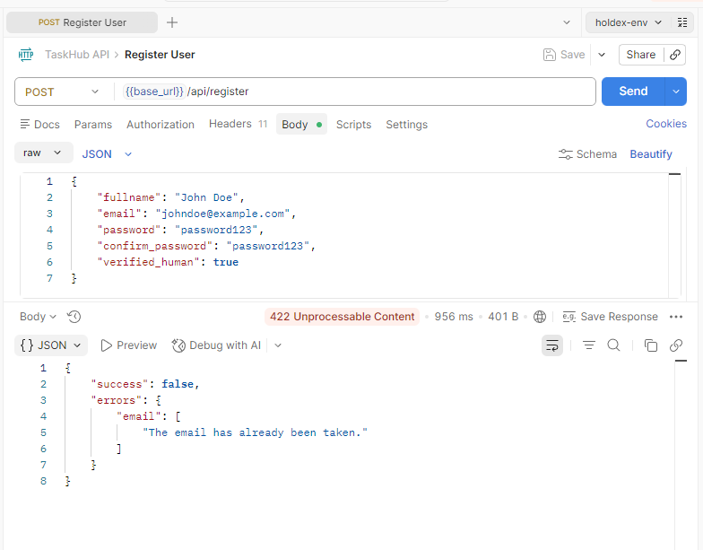
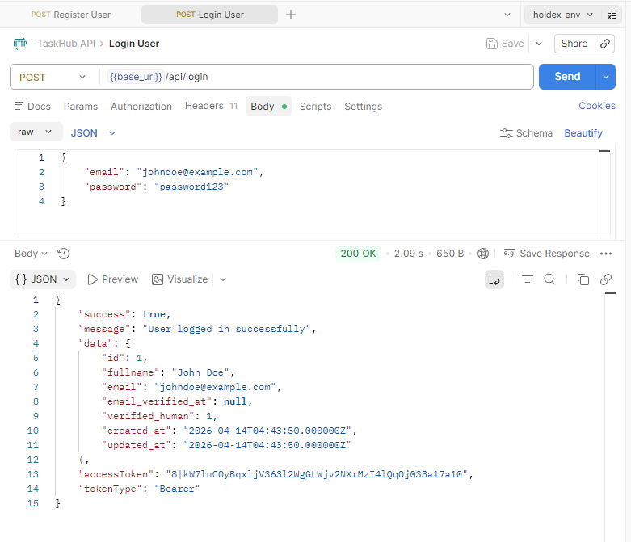
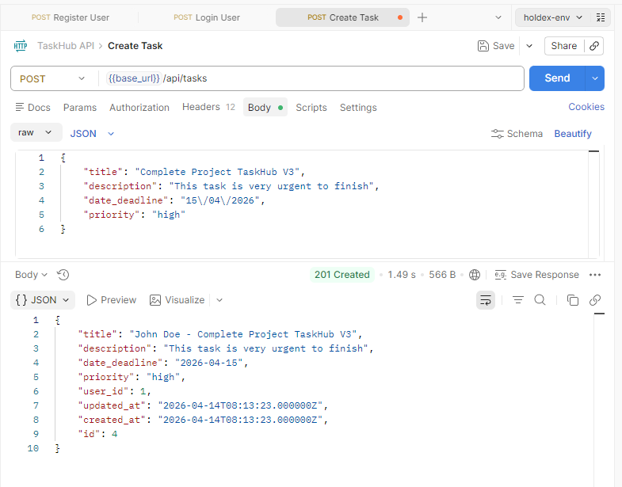

# TaskHub+ Backend API

Repositori ini berisi kode sumber untuk backend layanan TaskHub+, yang dibangun menggunakan framework Laravel. Backend ini menyediakan berbagai endpoint REST API untuk mendukung fungsionalitas aplikasi manajemen tugas, termasuk autentikasi pengguna dan manajemen tugas.

## Teknologi Utama

- **Framework:** Laravel 10
- **Bahasa Pemrograman:** PHP 8.2+
- **Database:** MySQL / MariaDB
- **Autentikasi:** Laravel Sanctum

## Persyaratan Sistem

Pastikan perangkat Anda telah memenuhi persyaratan berikut sebelum memulai instalasi:

- PHP >= 8.2
- Composer
- MySQL atau MariaDB
- Web Server (Apache/Nginx) atau PHP Desktop Development Server

## Langkah Instalasi

1. **Kloning Repositori**
   ```bash
   git clone <repository-url>
   cd taskhub/backend
   ```

2. **Instal Dependensi**
   ```bash
   composer install
   ```

3. **Konfigurasi Lingkungan**
   Salin file `.env.example` menjadi `.env` dan sesuaikan konfigurasi database Anda.
   ```bash
   cp .env.example .env
   ```

4. **Generate Application Key**
   ```bash
   php artisan key:generate
   ```

5. **Migrasi Database**
   Pastikan Anda telah membuat database kosong di MySQL sesuai dengan nama yang ada di file `.env`. Anda dapat menggunakan perintah migrasi:
   ```bash
   php artisan migrate
   ```
   **Atau**, Anda dapat mengimpor database secara manual menggunakan file SQL yang tersedia:
   - Lokasi File: `docs/taskhub_db.sql`
   - Gunakan aplikasi seperti phpMyAdmin, DBeaver, atau perintah `mysql` untuk mengimpor file tersebut ke database Anda.

6. **Menjalankan Server**
   ```bash
   php artisan serve
   ```

## Dokumentasi Pengujian API

Berikut adalah dokumentasi pengujian API menggunakan Postman untuk memastikan semua fungsi berjalan dengan benar.

### 1. Registrasi Pengguna (Register)
Endpoint ini digunakan untuk mendaftarkan akun pengguna baru ke dalam sistem.



### 2. Masuk Log (Sign In)
Endpoint ini digunakan untuk melakukan autentikasi pengguna dan mendapatkan token akses.



### 3. Membuat Tugas Baru (Create Task)
Endpoint ini digunakan untuk menambahkan tugas baru setelah pengguna berhasil melakukan autentikasi.
   

## Instruksi Penggunaan Postman

Saya telah menyediakan file koleksi Postman untuk memudahkan pengujian endpoint API. File tersebut berada di direktori `docs/`.

**Langkah-langkah Impor:**

1. Buka aplikasi Postman.
2. Klik tombol **Import** di pojok kiri atas.
3. Pilih file `taskhub_api_postman_collection.json` yang terletak di folder `backend/docs/`.
4. Sesuaikan variabel `base_url` pada koleksi jika diperlukan (default: `http://localhost:8000/api`).
5. Masukkan token autentikasi pada bagian Authorization untuk endpoint yang memerlukan proteksi.

## Lisensi

Proyek ini bersifat open-source dan dilisensikan di bawah [MIT license](https://opensource.org/licenses/MIT).

---
*Dibuat oleh risyandi.com - 2026*
