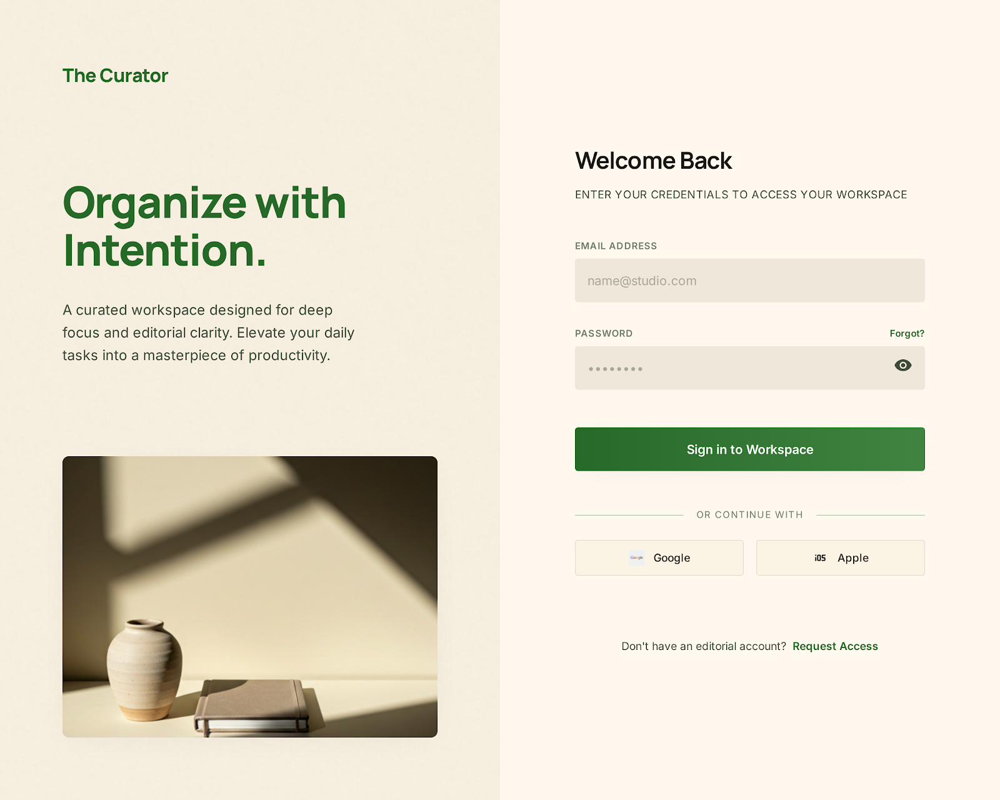
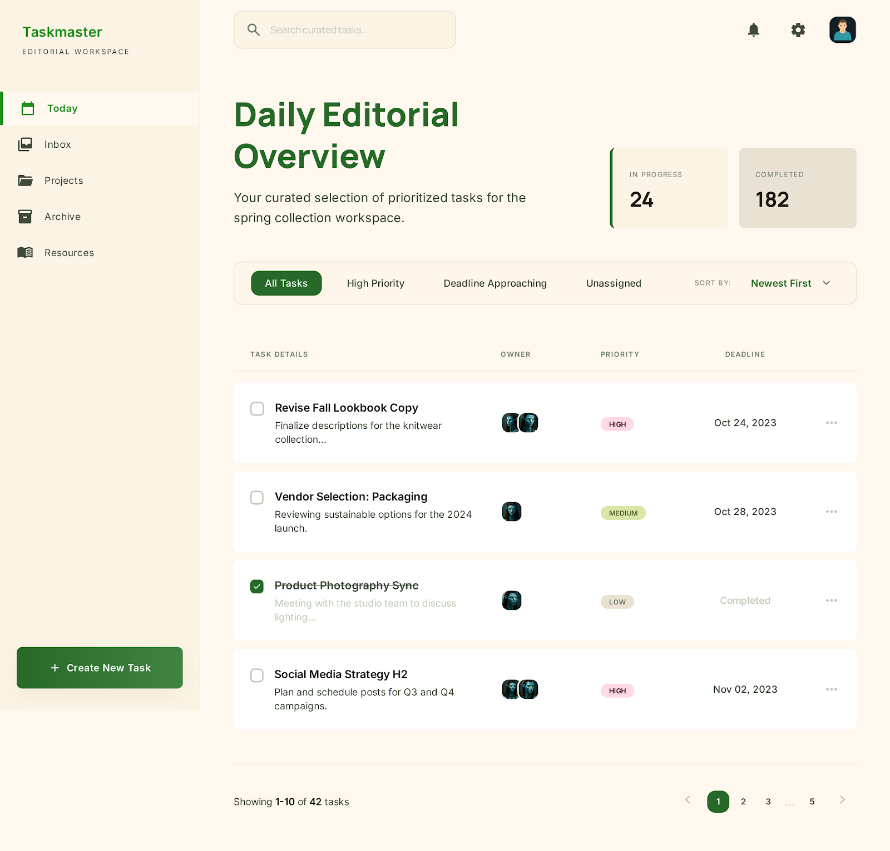
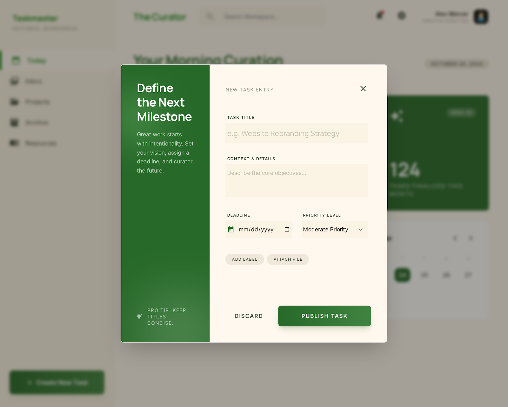
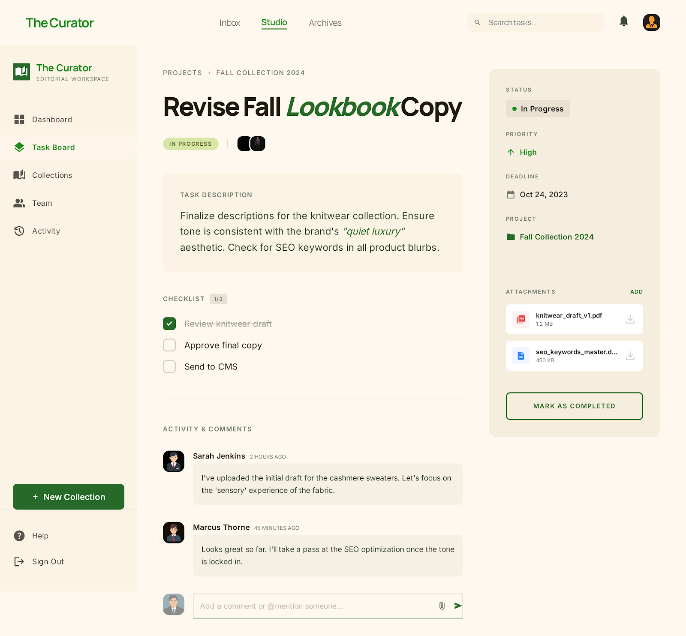

# TaskHub+ Frontend

Ini merupakan komponen frontend dari sistem TaskHub+, yang dikembangkan untuk manajemen tugas berperforma tinggi dengan antarmuka pengguna yang teroptimasi.

## Teknologi yang Digunakan

- **Framework**: [Next.js 14](https://nextjs.org/) (App Router)
- **Library**: [React 18](https://reactjs.org/)
- **Styling**: [Tailwind CSS](https://tailwindcss.com/)
- **Bahasa**: [TypeScript](https://www.typescriptlang.org/)
- **Manajer Paket**: [pnpm](https://pnpm.io/)

## Panduan Instalasi dan Penggunaan

Langkah awal, pastikan seluruh dependensi telah terinstal:

```bash
pnpm install
```

Selanjutnya, jalankan server pengembangan:

```bash
pnpm dev
```

Aplikasi dapat diakses melalui alamat [http://localhost:3000](http://localhost:3000).

## Dokumentasi Desain Antarmuka (UI)

Berikut adalah dokumentasi desain awal dan wireframe untuk antarmuka TaskHub+ yang tersedia pada direktori `docs/design`.

### Halaman Login


### Halaman Registrasi


### Dashboard Utama


### Penambahan Tugas


### Detail Tugas


---
**Software Architect**: [Risyandi](https://github.com/risyandi)
